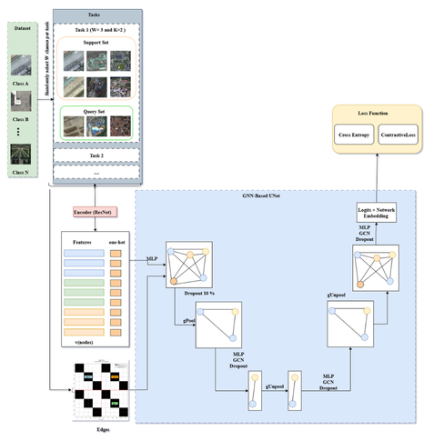

# GNN-CL for Few-Shot Satellite Image Classification

[cite_start]This repository contains the official PyTorch implementation for the paper: **"Enhancing Few-Shot Satellite Image Scene Classification with Graph Neural Network and Contrastive Learning"**[cite: 10, 11].

[cite_start]Our work introduces a novel framework (FSL-GNN-CL) that integrates Graph Neural Networks (GNNs) and Contrastive Learning (CL) [cite: 51] to tackle the challenges of Few-Shot Learning (FSL) in Remote Sensing (RS) satellite imagery.

## The Challenge

Few-shot classification of satellite images is particularly difficult due to two main factors:

* [cite_start]**High Intra-Class Variance:** Images within the same class (e.g., "urban" or "residential") can appear vastly different across various geographic regions[cite: 49, 195, 230].
* [cite_start]**Low Inter-Class Discriminability:** Different classes (e.g., "farmland" and "wetlands") can share very similar spectral and textural features, making them hard to distinguish[cite: 49, 195, 230].

## Our Solution: FSL-GNN-CL

[cite_start]We frame the few-shot task as a graph-based relational reasoning problem[cite: 51, 216]. [cite_start]Instead of classifying images in isolation, our model constructs a task-specific graph for each *support set* and *query set*[cite: 51].

1.  [cite_start]**Feature Extraction:** A ResNet encoder extracts deep features from all images in the current task (both support and query)[cite: 52, 415, 426].
2.  [cite_start]**Graph Construction:** These features become the **nodes** of a graph[cite: 237, 494]. [cite_start]**Edges** are constructed to represent relationships, primarily based on label equality for the known support set images[cite: 237, 416, 469].
3.  [cite_start]**Relational Reasoning:** A novel **GNN-Based UNet** propagates information across the graph[cite: 425, 494, 495]. This allows query images (nodes) to be classified based on their relationship and similarity to the support images (nodes), effectively modeling the high intra-class variance.
4.  [cite_start]**Hybrid Loss Function:** The network is trained using a joint loss function[cite: 51, 437]:
    * [cite_start]**Cross-Entropy Loss:** Ensures correct classification of the query images[cite: 51, 437, 502].
    * **Contrastive Loss:** Enforces feature separability. [cite_start]It pulls embeddings of the same class closer together while pushing embeddings from different classes apart[cite: 51, 437, 515].

## Architecture

The overall architecture of our proposed framework is shown below:



## Getting Started

### 1. Clone the Repository

```bash
git clone [https://github.com/0aub/fsl-gnn.git](https://github.com/0aub/fsl-gnn.git)
cd fsl-gnn
````

### 2\. Setup Environment

We recommend using a `conda` or `virtualenv` environment. The main dependencies are PyTorch and PyTorch Geometric.

```bash
pip install -r requirements.txt
```

A typical `requirements.txt` might look like this:

```
torch>=1.9.0
torchvision>=0.10.0
torch-scatter
torch-sparse
torch-cluster
torch-spline-conv
torch-geometric
numpy
tqdm
```

### 3\. Download Datasets

[cite\_start]Our paper evaluates performance on four standard FSL-RS benchmarks[cite: 537]:

  * [cite\_start]**UCMerced (UCM)** [cite: 537, 551]
  * [cite\_start]**Aerial Image Dataset (AID)** [cite: 537, 557]
  * [cite\_start]**WHU-RS19** [cite: 537, 571]
  * [cite\_start]**NWPU-RESISC45 (NWPU45)** [cite: 537, 561]

Please download the datasets and place them in a `data/` directory (or update the paths in the training script accordingly).

### 4\. Run Training

You can start training using the main script. [cite\_start]The key arguments are `--dataset`, `--n_way` (W), and `--n_shot` (K), which correspond to the 5-way 1-shot and 5-way 5-shot tasks evaluated in the paper[cite: 537].

**Example: 5-way 1-shot training on UCMerced**

```bash
python train.py --dataset UCMerced --n_way 5 --n_shot 1
```

**Example: 5-way 5-shot training on NWPU-RESISC45**

```bash
python train.py --dataset NWPU-RESISC45 --n_way 5 --n_shot 5
```

## Results

Our model achieves state-of-the-art results by effectively combining relational graph reasoning with discriminative contrastive learning. We demonstrate significant accuracy improvements over existing methods on all four datasets.

  * [cite\_start]**UCMerced (5-way 1-shot):** $96.90%\\pm0.00%$ accuracy [cite: 678, 701][cite\_start], a **$29.63%$** improvement over the DEADN4 baseline[cite: 644, 690].
  * [cite\_start]**AID (5-way 1-shot):** $96.42%\\pm2.3%$ accuracy [cite: 678, 700][cite\_start], a **$28.71%$** improvement over the TDNet baseline[cite: 655, 689].
  * [cite\_start]**NWPU-RESISC45 (5-way 5-shot):** $98.43%\\pm0.47%$ accuracy [cite: 678, 681, 697][cite\_start], a **$9.95%$** improvement over the $CS^{2}TFSL$ baseline[cite: 682].
  * [cite\_start]**WHU-RS19 (5-way 5-shot):** $98.13%\\pm0.57%$ accuracy[cite: 678, 662, 699].

## Citation

If you find this work useful for your research, please cite our paper:

```bibtex
@article{khelifi2024enhancing,
  title={Enhancing Few-Shot Satellite Image Scene Classification with Graph Neural Network and Contrastive Learning},
  author={Manel Khazri Khelifi and Ayyub Alzahem and Wadii Boulila and Anis Koubaa and Imed Riadh Farah},
  journal={},
  publisher={},
  year={2024},
  url={}
}
```

```
```
